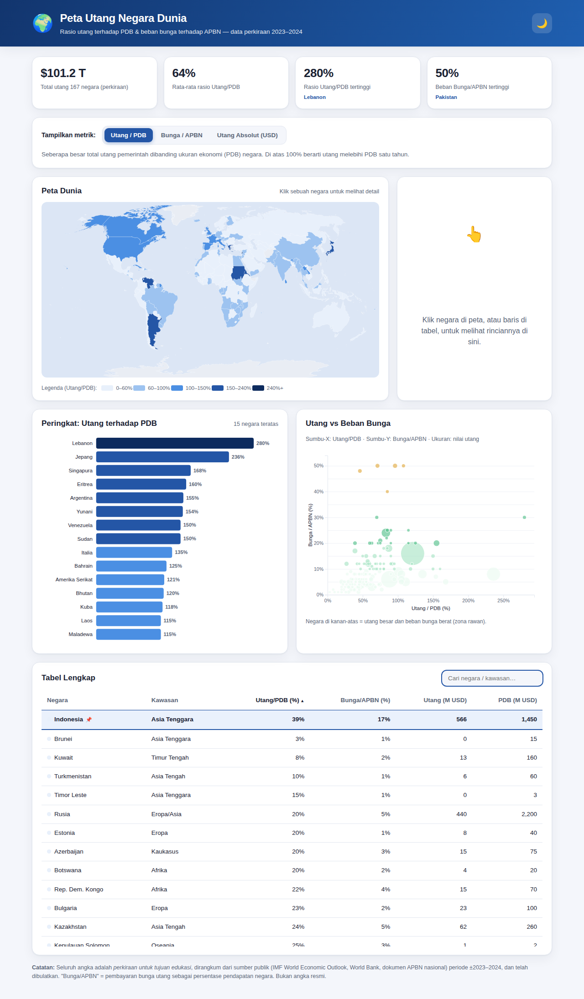

# 🌍 Peta Utang Negara Dunia

Visualisasi interaktif utang pemerintah negara-negara besar dunia — **rasio utang terhadap PDB** dan **beban bunga terhadap APBN (pendapatan negara)**.



## Fitur

- **Peta dunia interaktif (choropleth)** — negara diwarnai sesuai metrik terpilih. Klik sebuah negara untuk melihat rinciannya. Bisa di-zoom & digeser.
- **Panel detail** — muncul saat negara diklik: Utang/PDB, Bunga/APBN, dan nilai utang absolut, lengkap dengan bar mini + penjelasan.
- **3 metrik yang bisa dipilih:**
  1. **Utang / PDB** — total utang pemerintah dibanding ukuran ekonomi.
  2. **Bunga / APBN** — persentase pendapatan negara yang tersedot hanya untuk membayar bunga utang tiap tahun.
  3. **Utang Absolut (USD)** — nilai utang dalam miliar dolar AS.
- **Grafik batang** — peringkat 15 negara teratas untuk metrik terpilih.
- **Scatter plot (bubble)** — Utang/PDB (X) vs Bunga/APBN (Y), ukuran gelembung = nilai utang. Membantu melihat negara yang utangnya besar *sekaligus* beban bunganya berat ("zona rawan" kanan-atas).
- **Tabel lengkap** — ~167 negara, bisa diurutkan (klik header) dan dicari. **Indonesia disematkan (pin) di baris paling atas dan tetap menempel (freeze)** bersama header saat tabel di-scroll.
- **Kartu ringkasan**, **mode terang/gelap**, dan **responsif** (desktop & ponsel).

Peta, grafik, panel, dan tabel semuanya **saling terhubung** — memilih negara di mana pun akan menyorotinya di seluruh tampilan.

## Cara menjalankan

Cukup buka `index.html` di browser — semua aset (D3, TopoJSON, data peta) sudah disertakan secara lokal, tidak perlu koneksi internet.

Jika ingin lewat server lokal:

```bash
python3 -m http.server 8000
# lalu buka http://localhost:8000
```

## Struktur

```
index.html            # halaman utama
css/styles.css        # gaya + tema terang/gelap
js/data.js            # dataset negara + definisi metrik & skala warna
js/app.js             # peta, grafik, tabel, interaksi (D3)
vendor/               # D3, topojson-client, data peta dunia (world-atlas)
```

## Sumber & keterbatasan data

⚠️ **Seluruh angka adalah perkiraan untuk tujuan edukasi/visualisasi**, dirangkum dari sumber publik
(IMF World Economic Outlook, World Bank, dan dokumen APBN/anggaran nasional) periode **±2023–2024**, dan telah dibulatkan.
Angka-angka ini **bukan data resmi** — untuk analisis serius, rujuk sumber aslinya.

- Mencakup **~167 negara**. Wilayah yang tetap abu-abu di peta adalah teritori/dependensi tanpa data pemerintah terpisah atau data tak tersedia (mis. Greenland, Sahara Barat, Antarktika, Korea Utara, serta beberapa negara pulau kecil).
- "Utang" merujuk pada **utang pemerintah bruto** (general government gross debt).
- "Bunga / APBN" = **pembayaran bunga utang sebagai persentase pendapatan negara**. Ini indikator umum keberlanjutan fiskal; jika memperhitungkan cicilan pokok, beban total bisa jauh lebih tinggi.

### Cara memperbarui data

Edit tabel `RAW_DEBT_DATA` di `js/data.js`. Setiap baris: `[iso, nama, kawasan, PDB(USD miliar), Utang/PDB(%), Bunga/Pendapatan(%)]`.
Nilai utang absolut dihitung otomatis. Kode `iso` adalah ISO 3166-1 numerik agar cocok dengan peta.
